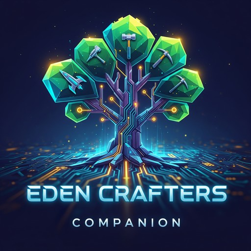
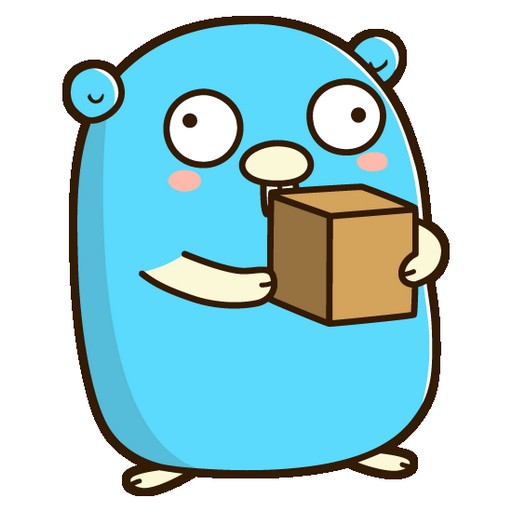

# Tipi App Store ⛺

> [!WARNING]  
> This repository is still being updated but no new apps will be accepted. Please only submit bug fix PRs here. If you need a particular app, look for community maintained stores or [create your own](https://runtipi.io/docs/guides/create-your-own-app-store). Read [this](https://github.com/runtipi/runtipi/issues/2317#issuecomment-3217972183) for more details.

This is the official repository for the Tipi App Store. It contains all the apps that are available for download on [Tipi](https://github.com/runtipi/runtipi).

## How to get started

1. Install **[Node.js](https://nodejs.org/en)** on your machine
2. Install **[pnpm](https://pnpm.io/installation)** package manager
3. Install dependencies (from the root of the project)

```bash
pnpm install
```

## How to sumbit an app

If you want to see new apps on Tipi you can either:

- [Create a discussion](https://github.com/runtipi/runtipi-appstore/discussions) on this repository and members of the community will add it
- [Join the Discord](https://discord.gg/Bu9qEPnHsc) members of the community will add it.
- Fork this repo and create the necessary files for a Tipi app. Follow this [guide](https://www.runtipi.io/docs/contributing/adding-a-new-app)`

## Apps available (24)

| Name                                                                    | Description                                                                              | Port                                                                                                       | Dynamic (<!dynamicConfigCount>) |
| ----------------------------------------------------------------------- | ---------------------------------------------------------------------------------------- | ---------------------------------------------------------------------------------------------------------- | ------------------------------- |
|              | [AFFiNE Custom](https://github.com/toeverything/affine)                                  | AFFiNE is a workspace with fully merged docs, whiteboards and databases.                                   |
|                 | [Blazor RSS](https://github.com/rodrigomescua/BlazorRssDocker)                           | Blazor RSS                                                                                                 |
|      | [Blazor RSS - Restricted](https://github.com/rodrigomescua/BlazorRssDocker)              | Blazor RSS Restricted                                                                                      |
|                     | [Blinko](https://github.com/blinkospace/blinko)                                          | Bring Your Ideas to Life with AI                                                                           |
|                     | [Byparr](https://github.com/ThePhaseless/Byparr)                                         | Bypass Cloudflare and DDoS-GuARD.                                                                          |
|                   | [Colanode](https://github.com/colanode/colanode)                                         | Open-source & local-first collaboration workspace that you can self-host                                   |
|                   | [Dawarich](https://github.com/Freika/dawarich)                                           | Self-hostable alternative to Google Location History (Google Maps Timeline)                                |
|                   | [Donetick](https://github.com/donetick/donetick)                                         | Simplify Tasks & Chores, Together!                                                                         |
|          | [Eclipse Mosquitto](https://github.com/eclipse/mosquitto/)                               | The MQTT protocol provides a lightweight method of carrying out messaging using a publish/subscribe model. |
|     | [Eden Crafters Companion](https://github.com/rodrigomescua/EdenCraftersCompanion)        | Eden Crafters Companion                                                                                    |
|       | [FreshRSS Image Cache Service](https://github.com/s373r/freshrss-image-cache-service-rs) | Image caching service for FreshRSS with time-limited link support                                          |
|                 | [KitchenOwl](https://github.com/tombursch/kitchenowl)                                    | KitchenOwl                                                                                                 |
|                      | [Maxun](https://github.com/getmaxun/maxun)                                               | Open-Source No-Code Web Data Extraction Platform                                                           |
|               | [MediaManager](https://github.com/maxdorninger/MediaManager)                             | Media Manager                                                                                              |
|         | [Owntracks Recorder](https://github.com/owntracks/docker-recorder)                       | Store and access data published by OwnTracks apps                                                          |
|                     | [Photon](https://github.com/rtuszik/photon-docker)                                       | This is an unofficial docker image for Photon                                                              |
|                 | [Razor IPTV](https://github.com/romesc/RazorIptvDocker)                                  | Razor IPTV                                                                                                 |
|             | [Razor Miniflux](https://github.com/romesc/RazorMinifluxDocker)                          | Razor Miniflux                                                                                             |
|  | [Razor Miniflux - Restricted](https://github.com/romesc/RazorMinifluxDocker)             | Razor Miniflux Restricted                                                                                  |
|         | [Razor Price History](https://github.com/romesc/RazorPriceHistory)                       | Razor Price History                                                                                        |
|                     | [Reitti](https://github.com/dedicatedcode/reitti)                                        | Personal Location Tracking & Analysis - Self-hosted alternative to Google Timeline                         |
|                   | [Tracktor](https://github.com/javedh-dev/tracktor)                                       | Vehicle Tracking Management System                                                                         |
|                     | [Upsnap](https://github.com/seriousm4x/UpSnap)                                           | A simple wake on lan web app written with SvelteKit, Go and PocketBase.                                    |
|                   | [Wallabag](https://github.com/wallabag/wallabag)                                         | Wallabag                                                                                                   |
